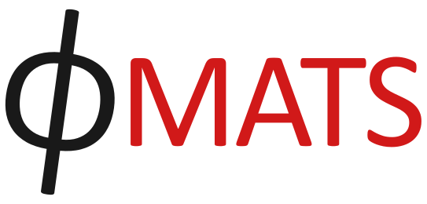

 

**PHIMATS** (Phase-field Multiphysics Materials Simulator) is a finite element library in C++, originally designed for simulating mesoscale **hydrogen-material interactions** using phase-field based representative volume element (RVE). However, its modular design allows it to be applied to a **wide range of multiphysics problems**.

---

## Applications
- **Phase-field based RVE models** for **hydrogen-material interactions**  
- **Solid mechanics**   
- **Heat and mass transfer** modeling  

---

## Features
- **Pre/Post processing via Python interface** for flexible input/output handling  
- **Object-oriented C++** with **inheritance & polymorphism** for modularity  
- **HDF5-based data storage** for efficient data handling  
- **XDMF format support** for visualization in **ParaView**  

---

## Documentation
- **Companion theory manual:** *[Finite Element Theory for PHIMATS](https://arxiv.org/abs/2502.16283)*  
- **Publications & examples:** Available in the `CaseStudies` directory  
- **Doxygen documentation:** [Online API Reference](https://ahcomat.github.io/doxygen-phimats/index.html)  

---

## Download 

To download **PHIMATS**, clone the repository using **Git**:

```sh
git clone https://github.com/ahcomat/PHIMATS.git
cd phimats
```

Alternatively, you can download the repository as a **ZIP file**:  
1️⃣ Click the **"Code"** button on the GitHub repository page.  
2️⃣ Select **"Download ZIP"** and extract the contents.  
3️⃣ Open a terminal and navigate to the extracted folder:  
   ```sh
   cd phimats
   ```

Once downloaded, follow the **installation guide** below to set up dependencies and compile the code.
 
---

## Installation Guide

### **1️⃣ System Requirements**
✅ **Linux OS required** (Recommended: Ubuntu, Debian, Fedora)
✅ **Windows users:** Use **Windows Subsystem for Linux (WSL)**
⚠️ **macOS:** Potentially supported but untested 
❌ **No support for Windows (native)**  

---

### **2️⃣ Required Dependencies**
#### **🔹 Third-Party Libraries**
- **[Eigen](http://eigen.tuxfamily.org)**
- **[HDF5](https://www.hdfgroup.org/solutions/hdf5/)**
- **[PETSc](https://www.mcs.anl.gov/petsc/)**  

#### **🔹 Python Dependencies (via Conda)**
 All required Python libraries are included in the **`phimats`** Conda environment.

To create the environment, run:
```sh
conda env create -f environment.yml
```

#### **🔹 C++ Compiler & Tools**
✅ **C++20 compiler (GCC recommended)**  
✅ **Install `mpich` for parallel computing** (MPI support is under development—current builds compile with MPI but run in serial mode.)  
✅ **Install `hdf5` library**  
✅ **ParaView v5.9.1 for visualization**  

---

### **3️⃣ Installing PETSc**
PETSc must be installed with an **optimized configuration** (`arch-opt`).  
Make sure the PETSc directory is located at:
```sh
/home/your_user_name/petsc
```
where **`your_user_name`** is your system username.

#### **🔹 PETSc Installation Command**
Run the following command in your terminal:
```sh
./configure PETSC_ARCH=arch-opt --with-cc=gcc --with-cxx=g++ \
--download-f2cblaslapack --download-cmake --download-scalapack \
--download-mumps --download-mpich --with-debugging=0 \
COPTFLAGS='-O3 -march=native -mtune=native' \
CXXOPTFLAGS='-O3 -march=native -mtune=native' \
FOPTFLAGS='-O3 -march=native -mtune=native'
```

---

### **4️⃣ Setting Up Environment Variables**
Add the following lines **(after modifying the paths)** to your `~/.bashrc` file:
```sh
export PETSC_DIR=/home/your_user_name/petsc
export PETSC_ARCH=arch-opt

export PYTHONPATH=$PYTHONPATH:/path_to_PHIMATS/src/FEM_utils/

export EIGEN=/path_to_eigen/eigen/
export PHIMATSINCLUDES=/path_to_PHIMATS/PHIMATS/src/include/
export PHIMATSLIBDIR=/path_to_PHIMATS/PHIMATS/src/lib/

# Detect HDF5 installation path automatically
export H5LD=$(h5cc -show | awk '{for(i=1;i<=NF;i++) if($i ~ "-L") print substr($i,3)}')
export H5ID=$(h5cc -show | awk '{for(i=1;i<=NF;i++) if($i ~ "-I") print substr($i,3)}')
export HDF5_USE_FILE_LOCKING=FALSE

# Detect MPICH installation path automatically
export MPICHID=$(mpicc -show | awk '{for(i=1;i<=NF;i++) if($i ~ "-I") print substr($i,3)}')
export MPICHLD=$(mpicc -show | awk '{for(i=1;i<=NF;i++) if($i ~ "-L") print substr($i,3)}')

```
After adding these, apply the changes by running:
```sh
source ~/.bashrc
```

---

### Final Checklist Before Compiling PHIMATS
- **Ensure all dependencies are installed correctly**  
- **Check that PETSc is compiled with `arch-opt`**  
- **Verify environment variables using:**  
```sh
echo $PETSC_DIR
echo $PETSC_ARCH
```
- **Ensure Python dependencies are installed via Conda**  
```sh
conda activate phimats
```

---

### **5️⃣ Compiling PHIMATS**
Once everything is installed, navigate to the **PHIMATS directory** and compile the code by running:
```sh
make
```
---

### Usage

To balance **simulation flexibility** with **high performance**, `PHIMATS` is compiled as a **library (`libphimats.a`)**, which must be linked with a **custom driver code**.  

**Example driver codes** and **hands-on tutorials** can be found in the `CaseStudies` directory. The `makefile` in the subdirectories handles the compilation and linking automatically. These examples demonstrate how to use **PHIMATS** for various **hydrogen-material interaction simulations** and related applications.  

---

### Citation  
For citing **PHIMATS**, please use:  
**A. Hussein**, *Finite Element Theory for PHIMATS*, 2025. doi: 10.48550/ARXIV. 2502.16283.

Additionally, consider citing relevant references from the `CaseStudies` directory if applicable.  

---

### License
**PHIMATS** is released under the **[GNU General Public License v3.0](https://www.gnu.org/licenses/gpl-3.0.html)**, or later.  

